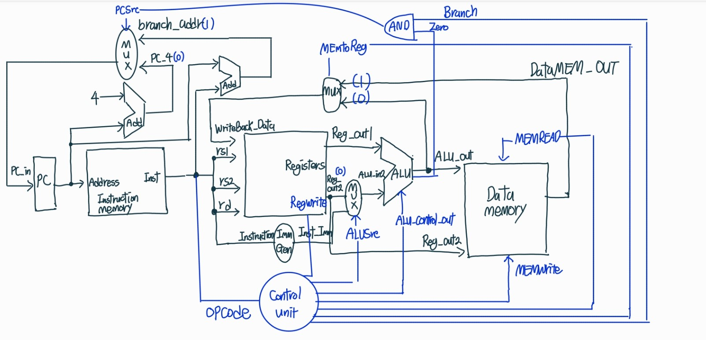

# Single-Cycle RISC-V CPU 설계 및 FPGA 구현

1. 프로젝트 개요 (Overview)
이 프로젝트는 Verilog HDL을 사용하여 RISC-V 32I의 기본 명령어 세트(`add`, `addi`, `sw`, `lw`, `beq`)를 지원하는 32비트 Single-Cycle CPU를 설계하고, 시뮬레이션 및 FPGA 보드를 통해 동작을 검증한 결과물입니다. 컴퓨터 구조의 핵심 원리를 실제 하드웨어로 구현하는 경험을 목표로 했습니다.

---

 2. 개발 환경 (Development Environment)
* **설계 언어**: Verilog HDL
* **시뮬레이션/합성 툴**: Vivado 2025.1
* **검증용 FPGA 보드**: Digilent Arty A7-100T

---

 3. CPU 아키텍처 (CPU Architecture)
Single-Cycle 데이터패스 구조를 따르며, 하나의 명령어는 한 클럭 사이클에 모든 실행 단계를 마칩니다. 전체 데이터패스 구조는 아래와 같습니다.

  

### 4. 구현된 모듈 설명 (Module Descriptions)
* **`src/`**: CPU를 구성하는 모든 Verilog 파일이 들어있습니다.
    * `arty_a7_top.v`: FPGA 보드의 clk, rst, led와 Singel_CPU 모듈을 연결하는 최상위 모듈
    * `ClockDivider.v`: FPGA 보드의 빠른 100MHz 클럭을 느린 클럭으로 변환하는 모듈
    * `Single_CPU.v`: 다른 모든 모듈을 통합한 CPU 모듈
    * `PC.v`: 다음에 실행할 명령어의 주소를 저장하고 업데이트하는 프로그램 카운터
    * `ControlUnit.v`: `opcode`를 해독하여 모든 제어 신호를 생성
    * `ALU.v`: 덧셈, 뺄셈, AND, OR 등 산술/논리 연산을 수행
    * `RegisterFile.v`: 32개의 32비트 레지스터를 포함하는 작업 공간
    * `Adder.v` : 32비트 add를 수행
    * `ALUControl.v` : ALU가 실제로 수행할 구체적인 4비트 연산 코드를 생성
    * `Ins_Mem.v`: 명령어들을 저장
    * `Data_Mem.v`: lw, sw 명령어 수행 시 데이터를 읽거나 쓰는 메모리.
    * `ImmGen.v`: 명령어에 포함된 다양한 형식의 상수를 32비트 값으로 확장하는 모듈
    * `Mux2to1.v`: 두 개의 데이터 경로 중 하나를 선택

---

### 5. 시뮬레이션 및 검증 (Simulation & Verification)
테스트벤치를 통해 CPU의 논리적 동작을 검증했습니다. `lw`, `sw`, `add`, `addi`를 포함한 테스트벤치 파일이 레지스터와 메모리에서 올바르게 실행되는 것을 아래 Waveform을 통해 확인했습니다.

**[시뮬레이션 Waveform]**   

---

### 6. FPGA 구현 및 실제 동작
설계된 CPU를 Arty A7 보드에 구현하여 실제 하드웨어 동작을 확인했습니다. CPU가 `program.coe`의 명령어를 순차적으로 실행하며 연산한 결과(`WriteBack_Data`)의 하위 4비트가 보드의 LED를 통해 실시간으로 출력됩니다.

**[FPGA 동작 영상]**   
